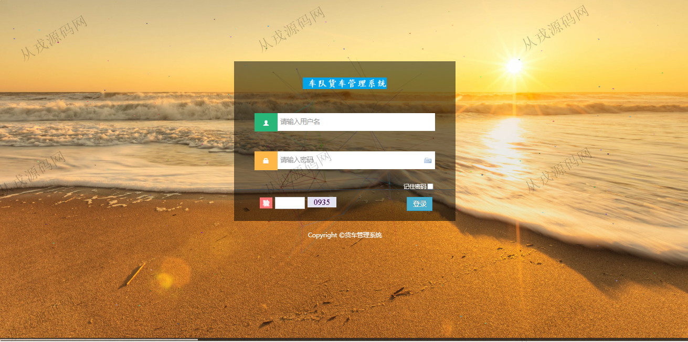
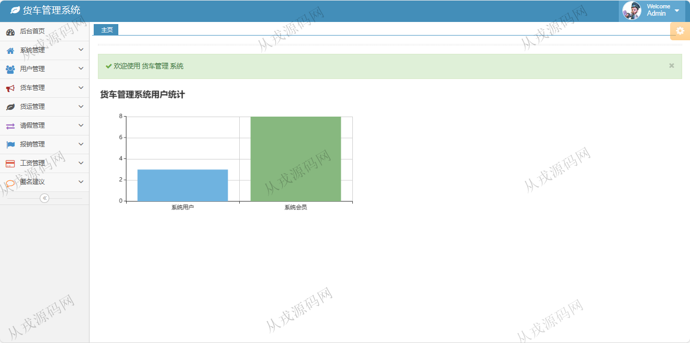
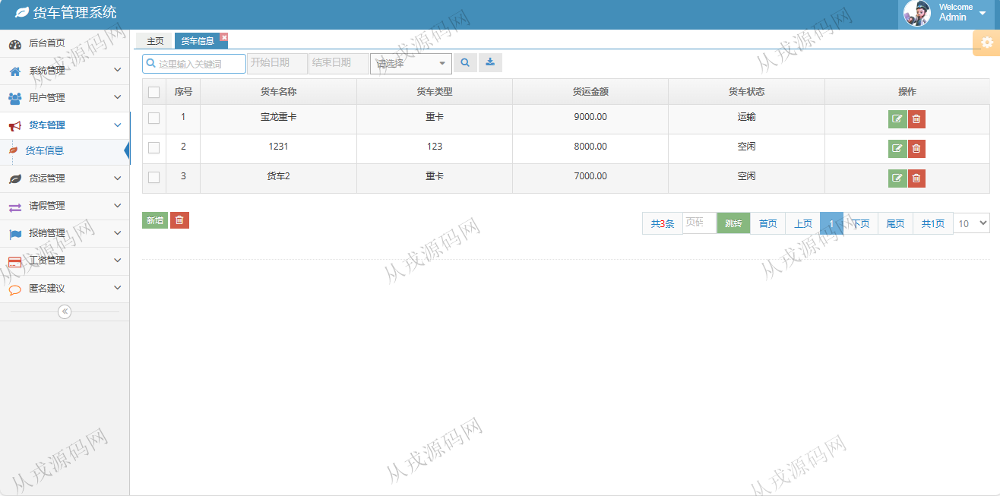
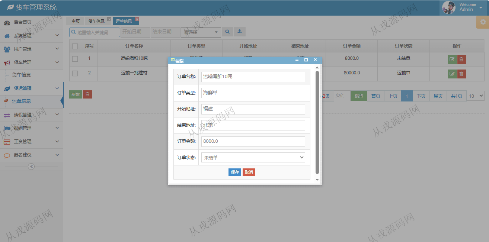
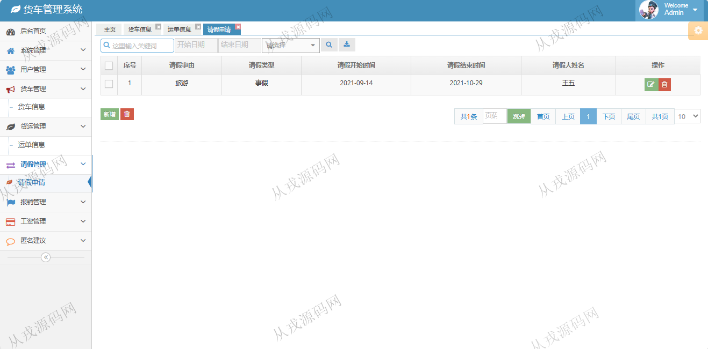
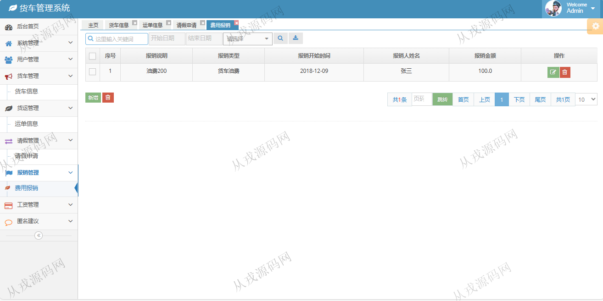
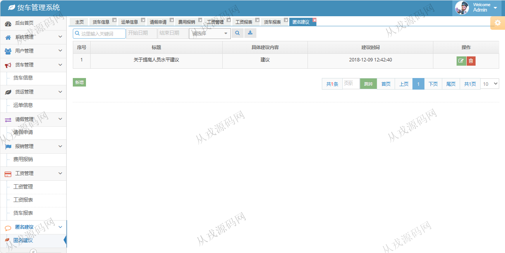

<h1 align="center">211.货车管理系统</h1>

- <b>完整代码获取地址：从戎源码网 ([https://armycodes.com/](https://armycodes.com/))</b>
- <b>技术探讨、资料分享，请加QQ群：692619798</b> 
- <b>作者微信：19941326836  QQ：952045282</b> 
- <b>承接计算机毕业设计、Java毕业设计、Python毕业设计、深度学习、机器学习</b>
- <b>选题+开题报告+任务书+程序定制+安装调试+论文+答辩ppt 一条龙服务</b>
- <b>所有选题地址 ([https://github.com/YuLin-Coder/AllProjectCatalog](https://github.com/YuLin-Coder/AllProjectCatalog)) </b>

## 项目介绍
基于ssm的货车管理系统【含报告】：前端 jsp、jquery，后端 springmvc、spring、mybatis；角色分为管理员、老板、司机；集成货车信息管理,运单信息管理,请假申请管理,费用报销管理等功能于一体的系统。

## 功能介绍

老板角色包含以下功能：
老板登录,角色管理,用户管理,货车信息管理,运单信息管理,请假申请管理,费用报销管理,工资管理,查看工资报表,查看货车报表,新增建议等功能。

管理员角色包含以下功能：
管理员角色,角色管理,菜单管理,在线管理,日志管理,用户管理,货车信息管理,运单信息管理,请假申请管理,费用报销管理,工资信息管理,匿名建议管理,查看工资报表,查看货车报表,修改管理员资料等功能。

司机角色包含以下功能：
司机登录,货车信息管理,运单信息管理,请假申请管理,费用报销管理,工资管理,修改司机资料等功能。

## 环境

- <b>IntelliJ IDEA 2021.3</b>

- <b>Mysql 5.7.26</b>

- <b>Tomcat 7.0.73</b>

- <b>JDK 1.8</b>

## 运行截图

