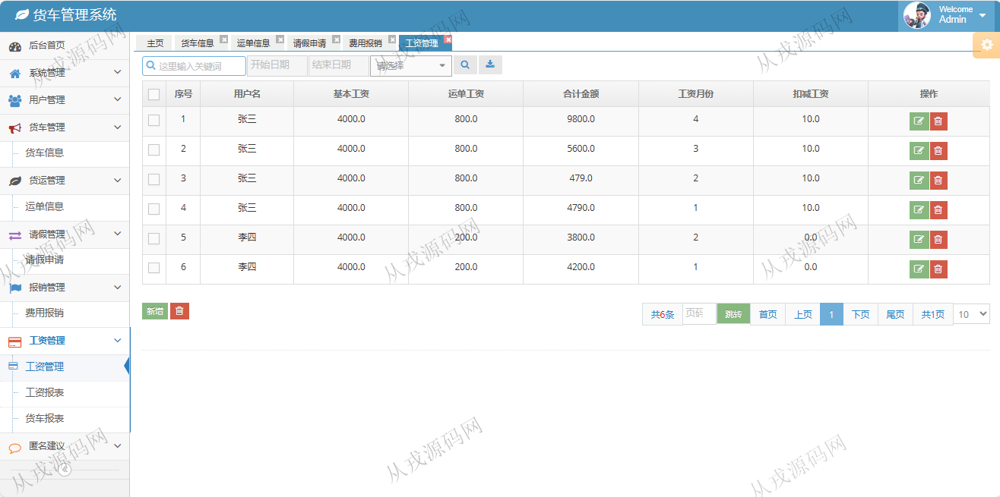

<h1 align="center">211.货车管理系统</h1>

 获取sql文件 QQ: 386869957 QQ群: 377586148 

 [更多源码项目: 从戎源码网](https://armycodes.com/) 

## 简介

> 本代码来源于网络,仅供学习参考使用!
>
> 提供1.远程部署/2.修改代码/3.设计文档指导/4.框架代码讲解等服务
>
> 访问地址 http://localhost:8080/
> 
> 管理员账号/密码：admin/123456
> 老板账号/密码：laoban/123456
> 司机账号/密码：siji/123456
> 

## 项目介绍
基于ssm的货车管理系统【含报告】：前端 jsp、jquery，后端 springmvc、spring、mybatis；角色分为管理员、老板、司机；集成货车信息管理,运单信息管理,请假申请管理,费用报销管理等功能于一体的系统。

## 功能介绍

老板角色包含以下功能：
老板登录,角色管理,用户管理,货车信息管理,运单信息管理,请假申请管理,费用报销管理,工资管理,查看工资报表,查看货车报表,新增建议等功能。

管理员角色包含以下功能：
管理员角色,角色管理,菜单管理,在线管理,日志管理,用户管理,货车信息管理,运单信息管理,请假申请管理,费用报销管理,工资信息管理,匿名建议管理,查看工资报表,查看货车报表,修改管理员资料等功能。

司机角色包含以下功能：
司机登录,货车信息管理,运单信息管理,请假申请管理,费用报销管理,工资管理,修改司机资料等功能。

## 环境

- <b>IntelliJ IDEA 2021.3</b>

- <b>Mysql 5.7.26</b>

- <b>Tomcat 7.0.73</b>

- <b>JDK 1.8</b>

## 运行截图

